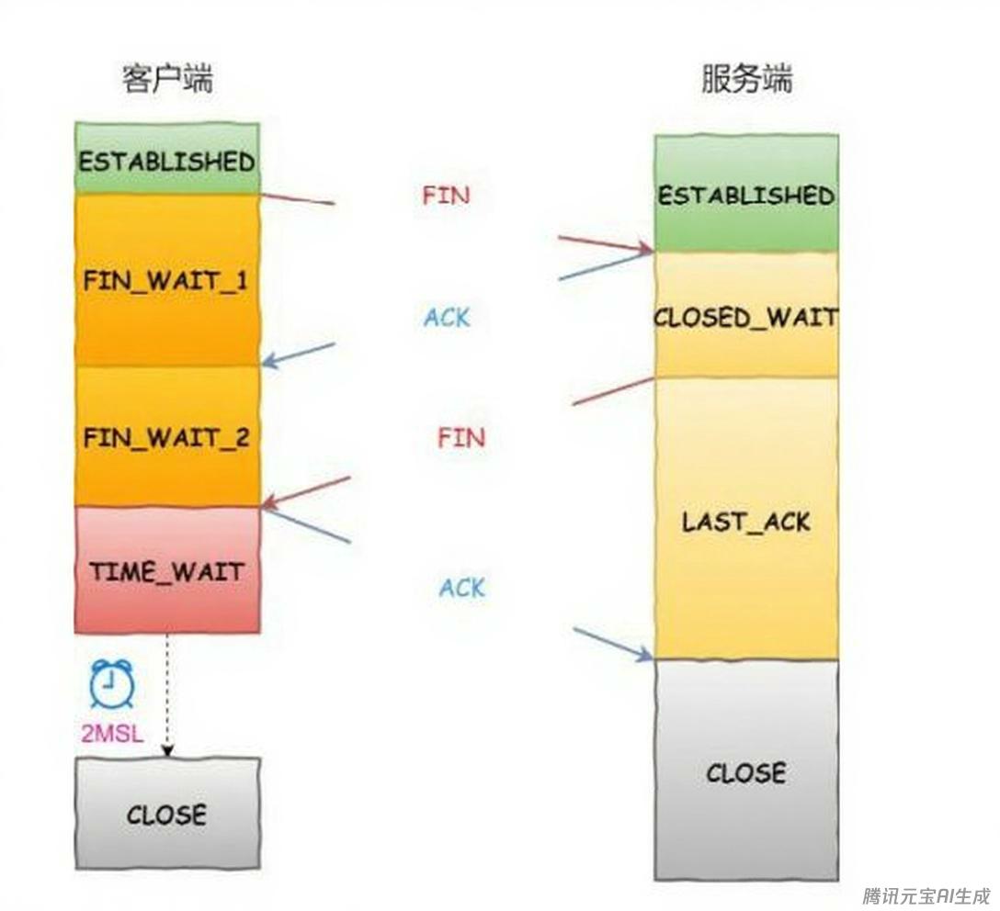

# 计算机网络八股文

## TCP三次握手和四次挥手，为什么这么设计？

- 三次握手：在建立TCP连接时，cilent客户端向server服务器端发送一个SYN（同步）标志的数据包，服务器端收到后回复一个SYN和ACK（确认）标志的数据包，表示接收到了客户端的请求，并同意建立连接，最后客户端再发送一个ACK标志的数据包，表示连接已经建立。这样就完成了三次握手，建立了连接。
- 四次挥手：在终止TCP连接时，一方（假设是客户端）向另一方（服务器端）发送一个FIN（结束）标志的数据包，表示要关闭连接，另一方收到后会回复一个ACK标志的数据包，表示收到了关闭请求。然后另一方再发送一个FIN标志的数据包给第一方，表示同意关闭连接，最后第一方再发送一个ACK标志的数据包，表示接收到了对方的关闭请求。这样就完成了四次挥手，终止了连接。

## TCP出现三次挥手是什么情况，会有什么影响？

当第四次挥手（Client的ACK）丢失或Server未收到ACK时，会出现三次挥手的情况。
三次挥手的影响：

- Server端资源泄露,最终导致端口耗尽，无法提供服务。
- 后续连接异常
- 数据传输错误

## TCP三次握手的原因是什么？

TCP三次握手是**建立可靠网络连接**的核心机制。原因有三个：

- **防止历史连接初始化**(核心原因)
- 同步双方初始序列号：为数据包提供有序标识，解决乱序、重复、丢包问题
- 避免资源浪费

## OSI模型下每层常见的协议有哪些？

具体内容会在协议八股文内介绍，此外会有详细的协议的介绍。如果时间充足的话。
应用层：**HTTP/HTTPS**，**DHCP**
表示层：**TLS/SSL**
会话层：RPC，SSH
传输层：**TCP,UDP**
网络层：IP,ICMP,**OSPF/BGP**,**ARP**，**IPsec**
数据链路层：Ethernet,WiFi，VLAN，HDLC
物理层：IEEE 802.3

## TCP的拥塞控制算法有哪些，请你详细介绍这些算法？

TCP的拥塞控制算法从远到近主要有：慢启动，拥塞避免，快重传，快恢复，CUBIC​算法，BIC算法，Vegas​算法，Veno​算法，BBR算法

- 慢启动：初始阶段以指数级增长探测网络容量，避免突发流量冲击。指数增长易导致突发丢包，尤其在高带宽网络中。
- 拥塞避免：线性增长cwnd，避免过度占用带宽。平衡网络负载，避免拥塞恶化。
- 快重传：通过重复ACK快速检测丢包，避免等待超时。连续收到3个重复ACK就会触发。
- 快恢复：避免因单个丢包直接回到慢启动，维持较高传输效率。
- CUBIC算法：使用三次函数替代线性增长，高带宽网络中更平稳，**Linux默认算法**。
- BIC算法：二分搜索寻找最大可用带宽，通过增/减窗口逼近平衡点。适用于**长距离高速网络**。
- Vegas​算法：通过RTT变化预测拥塞。若实际吞吐量低于预期，减小cwnd。与基于丢包的算法竞争时处于劣势。
- Veno​算法：丢包事件 → 触发快重传 → cwnd减半 → 进入快恢复 → 收到新ACK后退出恢复。结合丢包和延迟信号，区分无线丢包与真实拥塞丢包。适用于**无线网络**
- BBR算法：基于带宽和延迟估计，主动避免缓冲区膨胀

## ARP 欺骗是什么，如何防范？

ARP欺骗是一种网络攻击手段，通过伪造IP-MAC映射关系，导致数据被劫持或网络中断，在界面上的表现为本来通信的双方通信时断时续。这个问题可以从三个角度来回答：

- 网络设备层防御：开启ARP表项固化，学习到合法的ARP表项之后，将其绑定到端口，后续ARP表项将不再更新直到ARP表项手动使其失效。或者使用ARP严格学习，如果是固定设备的话使用该方法每次去校验ARP表项的接口和VLAN信息等，或者在更新ARP表项前发送ACK请求，确认ARP表项的变更。打开ARP报文的深度检查检查以太帧头部和ARP报文内容是否匹配。也可以使用安全协议如IPSEC去防御，IPSEC会将内外网IP分开，在通信双方间建立安全隧道保证通信的安全可靠。
- 网络架构优化：划分VLAN缩小广播域，PPPoE认证替代ARP(很挫的一种方法)，交换机端口安全绑定
- 终端防护措施：静态ARP绑定，安装ARP防火墙

## 什么是ICMP协议?

ICMP是TCP/IP协议族中网络层的协议，主要用于传输网络层控制消息的协议来达到**对网络信息进行诊断**，以及**发送错误报告**的目的。
⽐如ping 和traceroute就是通过icmp来对评估⽹络连接质量以及揭示数据包在⽹络的传输路径的来达到网络信息诊断的目的的。比如当数据包⽆法到达目的地时，路由器或目标主机就会发送目的地不可达消息，有助于识别网络问题，通过这种方式来达到发送错误报告的目的。
举个例子，我要和同事的一台电脑进行通信。我会首先ping一下他的电脑，首次ping肯定是失败的，由于没有学到ARP表项，会通过ARP协议进行学习，将同事的IP地址和MAC地址的映射到本地的网络层，有一个ARP表存储的ARP表项，然后我就可以知道IP和对应的MAC地址，后续的PING出去的ICMP报文就可以顺利到达同事，成功通信。目前的ICMP分为ICMP4和ICMP6，对应IP协议的V4和V6版本。

## 如何解决TCP的粘包?

解决TCP的粘包问题有以下几个方法：

- 添加消息边界：在发送数据时，给数据包添加⼀个特殊的边界标识，比如换行符或特殊字符。接收方在接收数据时，根据数据标识堆数据包进行拆分。
- 使用定长消息：约定每个数据包的长度固定。如果数据长度不足，那么就用特定字符去填写。这个方法适合于数据包长度固定的场景，但是可能会导致数据传输的效率降低。(比较挫，一般其他的协议也不会使用这种办法)
- 添加消息头：在发送数据的时候，为数据包添加⼀个消息头，在消息头中包含数据包的长信息。(有点类似蓝牙的协议，蓝牙协议就是这么做的)接收⽅在接收数据时，先解析消息头，获取数据包长度，然后根据长度对数据包进行拆分。4
- 使⽤应⽤层协议：使⽤HTTP或者FTP等协议，这些协议都已经解决了粘包问题。

## TCP挥⼿过程中，为什么需要存在time_wait状态？

- **防⽌错误接收历史报⽂**：如果立刻断开连接，那么有可能断开连接后，立刻复用了原来的ip地址和端口号进⾏了重新连接，上⼀次连接过程中发送的无效报⽂可能会在新的连接中到达，这时新的连接无法辨别出这个报⽂是上⼀次连接发送的报文，就可能会发⽣错误。
- 保证双⽅可以正常关闭：如果在客户端发送给服务端的ACK的报⽂丢失了，服务端会给客户端重传⼀个FIN,这个时间最长是2MSL， 客户端需要等待2MSL，判断在这个时间是否收到了服务端的重传的FIN的报⽂，如果收到了，客户端也要重传ACK报⽂，来保证双⽅正常关闭。

## 如何解决大量TIME_WAIT 状态的问题?

- 调整 MSL：减⼩最⼤报⽂段⽣存时间（MSL）的值，以减少TIME_WAIT状态的持续时 间。这样可以更快地释放 TIME_WAIT 状态的连接资源，但请注意，设置太⼩的MSL 值可能导致⽹络问题，如旧连接的数据包⼲扰新连接。
- 使⽤连接池：在客户端和服务器之间使⽤连接池，以便复⽤已经建⽴的TCP连接，⽽不是频繁地创建和关闭新连接。这可以显著减少TIME_WAIT状态的数量，同时提⾼应⽤程序的性能。
- 使⽤ SO_REUSEADDR 套接字选项：在某些情况下，可以在服务器端启⽤SO_REUSEADDR 套接字选项。这允许服务器在TIME_WAIT状态的连接上重新绑定和监听端口。但请注意，这种方法可能会导致新旧连接之间的数据包混淆，因此需要谨慎使用．
- 使⽤ SO_LINGER 套接字选项：在某些情况下，可以在客户端启⽤SO_LINGER套接字选项，并将延迟时间设置为0。这将导致客户端在关闭连接时⽴即发送RST（复位）信号，⽽不是正常的四次挥⼿过程。这样可以避免 TIME_WAIT 状态，但可能导致数据丢失，因此需要谨慎使⽤。
- 优化应用程序逻辑：根据应用程序的需求，优化客户端和服务器之间的通信逻辑，以减少不必要的连接创建和关闭。例如，可以使用长连接（keep-alive）或WebSocket 等技术来保持连接，减少 TIME_WAIT 状态的数量。

## https是如何进行加密的？

## 讲⼀下红⿊树的特性以及它和⼆插搜索树的区别?

- ⼆叉搜索树是⼀种特殊的⼆叉树，其中每个节点都有⼀个与之关联的键，且对于树中的所有节点，左⼦树中的所有键都小于节点的键，右⼦树中的所有键都⼤于节点的键。这使得⼆叉搜索树可以⾼效地执⾏查找、插⼊和删除操作。
- 红⿊树是⼀种自平衡的⼆叉搜索树，它在⼆叉搜索树的基础上**增加了⼀些额外的性质**。红⿊树的每个节点都有⼀个颜色属性，可以是红⾊或⿊⾊。并且节点的颜⾊之间存在⼀些特定规则。
